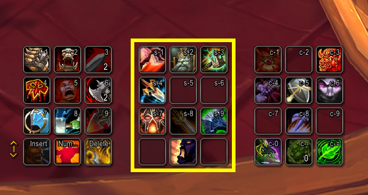
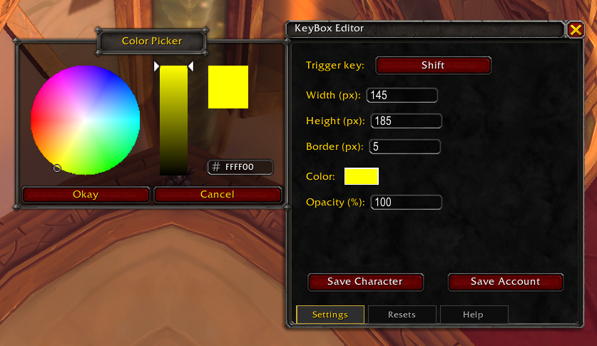

# KeyBox

KeyBox is a lightweight World of Warcraft add-on that shows a customizable
on-screen indicator while your chosen key is held.

If you use a modifier or another key for action-bar paging, abilities, or
another add-on, KeyBox provides immediate visual confirmation that World of
Warcraft is detecting the input.

## Features

- Choose a keyboard key recognized by World of Warcraft as the trigger.
- Treat left and right Shift, Ctrl, and Alt as a single modifier.
- Customize the indicator's width, height, border size, color, and opacity.
- Position the indicator by dragging it while the editor is open.
- Preview changes immediately before saving.
- Save shared account defaults or separate character overrides.
- Reset character and account settings independently.
- Load the built-in base settings without immediately saving them.
- Does not consume or block the configured key's normal input.

## Getting started

1. Enter `/keybox` in chat to open the editor.
2. Select **Trigger key**, then press the key you want KeyBox to monitor.
3. Adjust the indicator's appearance and drag the visible indicator to the
   desired position.
4. Select **Save Character** for a character-specific setup or **Save Account**
   to use it as the default for characters without an override.

Press Escape while choosing a trigger key to cancel key capture. The default
trigger is Shift.

## Examples

### Indicator in use

The yellow outline makes it easy to confirm that Shift is being detected while
using modifier-based action bars. The indicator can be positioned around the
part of the interface where that feedback is most useful.

### Settings

The **Settings** tab controls the trigger key, indicator dimensions, border,
color, and opacity. The indicator itself can be dragged to a new position while
the editor is open.

## Editor

The editor contains **Settings**, **Resets**, and **Help** tabs. The indicator
remains visible and can be dragged while the editor is open.

### Settings

The **Settings** tab provides controls for:

- Trigger key
- Width and height
- Border size
- Color
- Opacity

Selecting the color swatch opens World of Warcraft's color picker. Changes are
previewed immediately, but they are not persistent until saved.

The built-in base configuration is a centered, 200 by 200 pixel red indicator
with a 2 pixel border, 50% opacity, and Shift as its trigger.

### Saving

- **Save Character** creates or replaces the current character's override.
- **Save Account** creates or replaces the account default used by characters
  without an override. Existing character overrides are preserved.

The trigger key, dimensions, border, color, opacity, and dragged position are
all included when settings are saved.

### Settings priority

Settings are applied in this order:

1. Base settings.
2. Your account default.
3. The current character's saved override.

Each layer overrides values from the layers above it.

### Resets

The **Resets** tab provides three independent actions:

- **Reset Character** removes the current character's override and loads the
  account default, or the base settings when no account default exists.
- **Reset Account** removes the shared account default while preserving
  character overrides. Characters without an override return to the base
  settings.
- **Load Base Settings** previews the built-in configuration without changing
  any saved settings. Use **Save Character** or **Save Account** to persist it.

Closing the editor with its title-bar **X** discards previews made after the
most recent save or reset action. Saved and applied reset changes are retained.

## Installation

Install the `KeyBox` folder in:

`World of Warcraft/_retail_/Interface/AddOns/`

Restart World of Warcraft or reload the UI, then make sure KeyBox is enabled
in the in-game add-on list.

## Compatibility

KeyBox is designed for the current World of Warcraft Retail client.

## Localization

English strings are defined in `Locales/enUS.lua`. To add a translation:

1. Copy `Locales/enUS.lua` to a file named for the target WoW locale.
2. Keep the string keys unchanged and translate their values.
3. Guard the file with a `GetLocale()` check and add it to `KeyBox.toc` after
   the English locale so untranslated strings continue to use English.

## Contributing

Bug reports, fixes, and translations are welcome.

## Code organization

- `KeyBox.lua` coordinates add-on events, slash commands, and box visibility.
- `Locales/enUS.lua` defines English UI text and fallback strings for translations.
- `KeyBox_Defaults.lua` defines base settings, constraints, and UI dimensions.
- `KeyBox_Settings.lua` owns settings precedence, persistence, and resets.
- `KeyBox_Box.lua` owns box rendering, positioning, color updates, and edit-mode dragging.
- `KeyBox_Input.lua` tracks keyboard state and captures a configured trigger key without consuming gameplay input.
- `KeyBox_Edit.lua` builds and manages the editor UI.
- `KeyBox_Utils.lua` contains small shared helpers for clamping and messages.